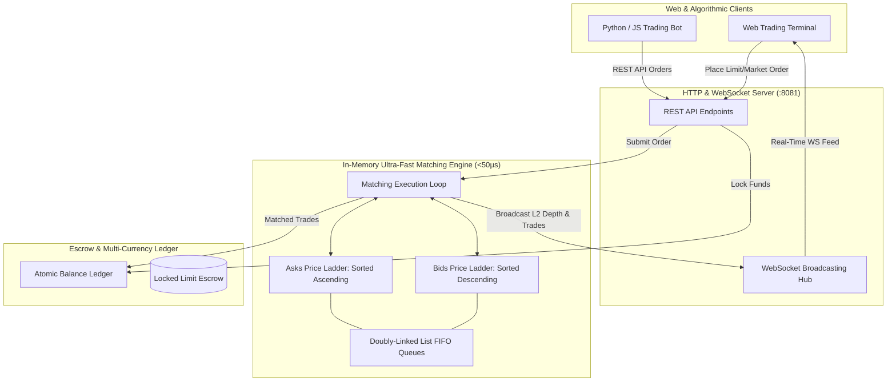

# ApexTrade: High-Speed Crypto Order Book & Matching Engine

[](https://go.dev/)
[]()
[]()
[]()
[]()

> **ApexTrade** is an ultra-low-latency, in-memory crypto and financial matching engine built in Go. It implements **FIFO Price-Time priority matching**, an $O(1)$ limit order book data structure, atomic multi-currency virtual escrow balances, and real-time **WebSocket L2 order book depth and trade tape streaming**.

---

## System Architecture



---

## Senior Engineering Highlights & Algorithmic Design

### 1. In-Memory $O(1)$ Order Book & Price-Time FIFO
* **Price Ladders:** Bids sorted descending (highest buy first), Asks sorted ascending (lowest sell first).
* **Limit Levels:** Each price point holds a **Doubly-Linked List** of resting orders.
  - Adding an order to the tail: **$O(1)$**
  - Unlinking a canceled order from anywhere in the list: **$O(1)$**
  - Instant order ID lookup via Hash Map index: **$O(1)$**
* **Deterministic Execution:** The oldest resting order at the best price is guaranteed to fill first.

### 2. Multi-Asset Escrow & Atomic Settlement Ledger
* When a user places a Limit Buy at \$3,000, \$3,000 USDT is moved atomically from `Available` to `Locked` escrow.
* On trade execution, base asset (ETH) and quote asset (USDT) are swapped atomically across both parties with zero rounding loss.
* Canceling an order instantly unlocks the unused escrow capital.

### 3. Real-Time WebSocket Streaming Engine
* Broadcasts sub-millisecond **L2 Depth updates**, **Live Trade Tickers**, and **User Portfolio balance changes** without polling.
* Includes an **Autonomous Liquidity Maker Bot** that creates continuous market activity and depth around current market prices.

---

## Project Structure

```
apextrade/
├── cmd/
│   └── server/           # Combined REST API, WebSocket Hub & Live Trading Terminal
│       └── main.go
├── pkg/
│   ├── engine/           # FIFO Matching Engine & Trade Generation
│   │   ├── matching_engine.go
│   │   ├── trade.go
│   │   └── engine_test.go
│   ├── ledger/           # Virtual Wallets, Escrow Locking, and Trade Settlement
│   │   ├── account.go
│   │   ├── ledger.go
│   │   └── ledger_test.go
│   ├── orderbook/        # High-Performance Order Book & Doubly-Linked FIFO Queues
│   │   ├── limit_level.go
│   │   ├── order.go
│   │   ├── orderbook.go
│   │   └── orderbook_test.go
│   └── websocket/        # Real-time WebSocket Hub
│       └── hub.go
├── go.mod
└── README.md
```

---

## Quickstart

### 1. Run All Unit & Concurrency Tests
```bash
go test -v ./...
```

### 2. Start the Live Exchange & Trading Terminal
```bash
go run ./cmd/server/main.go
```
Open your browser at: **`http://localhost:8081`**

---

## REST API Reference

| Method | Endpoint | Description |
| :--- | :--- | :--- |
| `GET` | `/health` | Engine health & status |
| `GET` | `/api/v1/orderbook` | Get aggregated L2 Bids & Asks depth |
| `GET` | `/api/v1/trades` | Get latest executed trades |
| `GET` | `/api/v1/account` | Get demo user wallet balances |
| `POST` | `/api/v1/orders` | Place a new Limit or Market order |
| `DELETE` | `/api/v1/orders/{id}` | Cancel an active resting order |
| `POST` | `/api/v1/faucet` | Claim virtual test funds (+$5,000 USDT) |
| `WS` | `/ws` | Real-time WebSocket feed |

---

## License
MIT
